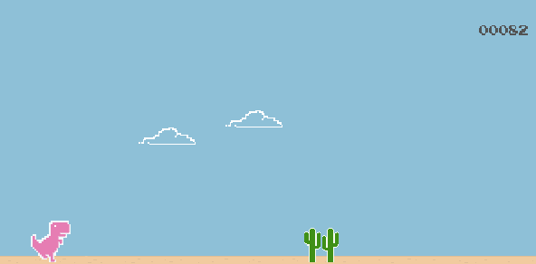
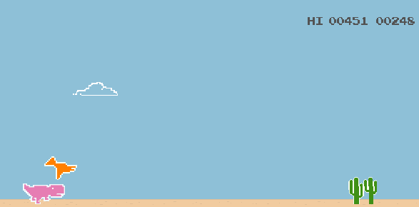

# Dino-PyGame

The famous dino arcade in PyGame. Inspired by Google Chrome's dino, this project presents a complete dino game, with a main menu and multiple screens. Made with pygame in python.

<p align="center">
  
</p>
<p align="center">
  
</p>

- This app can show multiple screens that load from the main menu.
- The game itself in the play screen  is a fully-featured dino game.
- The dinosaur can jump and craw, actions triggered by respectively space/w/up and s/down.
---

## Installation

To run this project you need python in a recent version and pip to install both pygame and pygame_menu. Create a directory in the project folder and run:

```
cd Dino-PyGame
pip install pygame
pip install pygame_menu
python main.py
```
Cd is for changing directory to the project folder. The pip install commands are for installing the required packages. The last command is to run main.py.

### Clone

- Clone this repo to your local machine using `https://github.com/edumigueis/Dino-PyGame.git`
---

## License


- **[MIT LICENSE](https://opensource.org/licenses/MIT)**
- Copyright 2020 © Eduardo Migueis.
